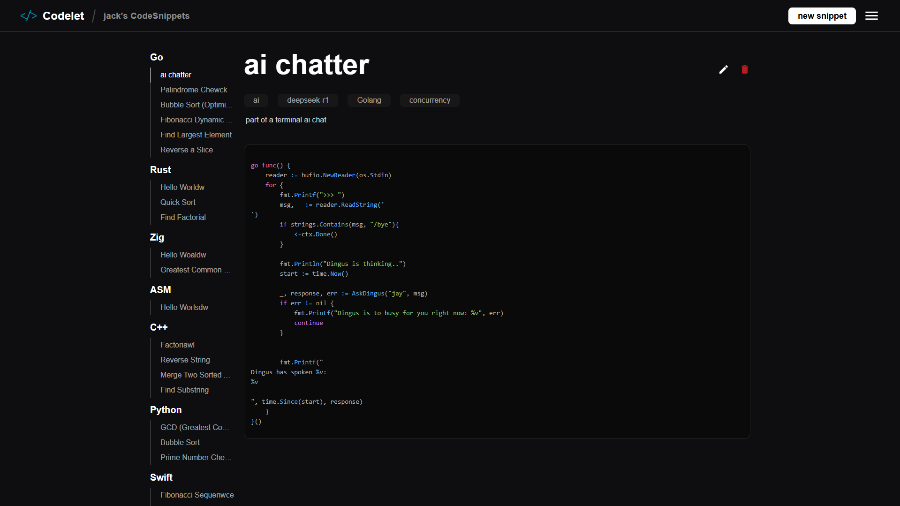
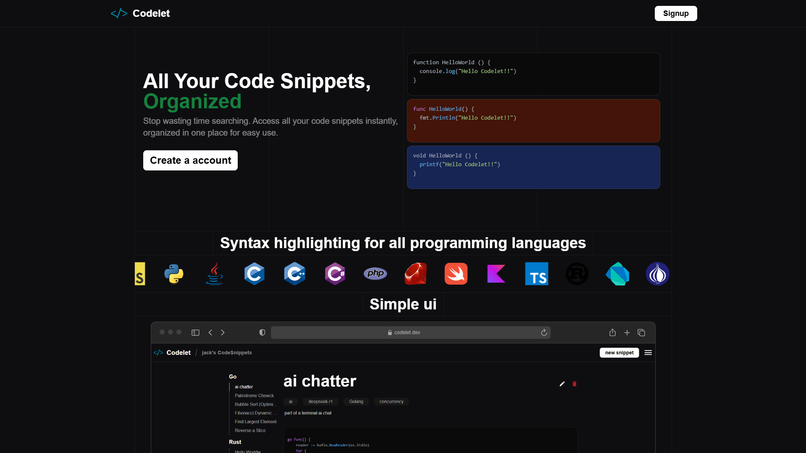

# Codelet - An Open-Source Code Snippet App




## All Your Code Snippets, Organized

Stop wasting time searching. Access all your code snippets instantly, organized in one place for easy use.

## Features

- **User System**: Sign up and manage your snippets with a personal account.
- **Syntax Highlighting**: Enjoy beautifully formatted code with syntax highlighting.
- **Categories**: Organize snippets by category for easy retrieval.
- **Dashboard**: A clean and intuitive dashboard to manage all your saved snippets.

## Installation

1. Clone the repository:
   ```sh
   git clone https://github.com/yourusername/codelet.git
   ```
2. Navigate to the project folder:
   ```sh
   cd codelet
   ```
3. Start the Backend:
   ```sh
   Docker compose up -d
   ```
4. Start the Fontend:
   ```sh
   cd web && npm run dev
   ```

